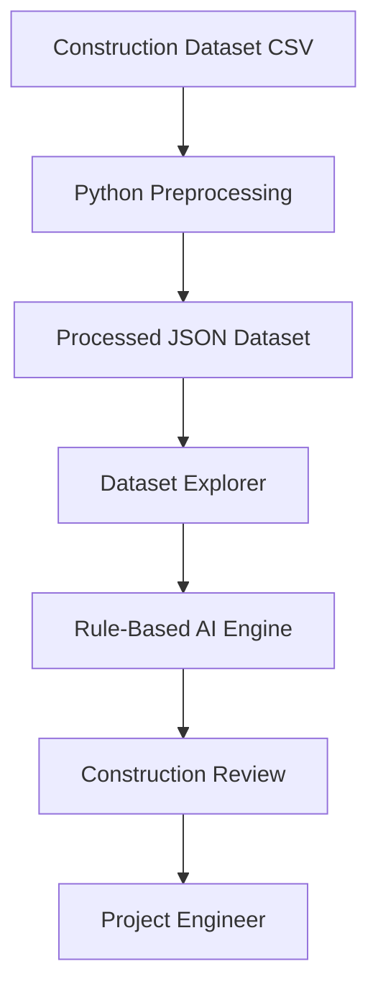

# 🏗️ ScopeGuard AI

> **AI-assisted construction issue review platform for project engineers.**
>
> ScopeGuard AI analyzes construction field tasks and provides explainable recommendations for Requests for Information (RFIs), Change Order Reviews, risk assessment, and engineering documentation using a transparent rule-based AI engine.

---

## Overview

Construction projects generate thousands of field issues throughout their lifecycle. Project engineers must quickly determine which issues require additional documentation, contractual review, or engineering attention.

ScopeGuard AI is a decision-support platform that helps streamline this review process by automatically analyzing construction tasks and generating structured engineering recommendations.

Rather than replacing human decision-making, ScopeGuard AI acts as an **AI copilot** that assists project teams with consistent, explainable analysis while keeping engineers in control of every decision.

---

## Problem

On large construction projects, project engineers often review hundreds or even thousands of field issues such as:

- Safety observations
- Design clarifications
- Material substitutions
- Scope changes
- Coordination conflicts
- Site conditions

Determining whether a task requires:

- a Request for Information (RFI),
- a Change Order,
- additional documentation,
- or immediate engineering review

can be time-consuming and inconsistent.

ScopeGuard AI demonstrates how AI can support these workflows while keeping humans responsible for final contractual and engineering decisions.

---

## Solution

ScopeGuard AI analyzes each construction task using an explainable rule-based AI engine and produces a structured engineering review including:

- Executive Summary
- Classification
- Confidence Score
- Confidence Breakdown
- AI Engineering Assessment
- Cost Risk
- Schedule Risk
- Draft Request for Information (RFI)
- Missing Information
- Documentation Checklist
- Recommended Actions

The application is intentionally designed as a **decision-support tool**, not an autonomous decision-making system.

---

# Features

### Dataset Explorer

- Search construction tasks
- Filter by Status
- Filter by Project
- Filter by Task Group
- Filter by Priority
- Pagination
- Analyze individual tasks
- View previous AI reviews
- Live analyzed task counter
- LocalStorage persistence

---

### AI Construction Review

Each task is analyzed through an AI workflow that simulates an engineering review process.

The workflow includes:

- Reading task description
- Evaluating safety indicators
- Reviewing project metadata
- Checking RFI triggers
- Assessing change-order risk
- Generating engineering recommendations

Once complete, the application produces a complete construction issue review.

---

# Architecture



The AI engine is intentionally isolated from the user interface so that the rule engine can later be replaced with an LLM without changing the frontend.

---

# Technology Stack

| Category | Technology |
|----------|------------|
| Frontend | Next.js |
| Language | TypeScript |
| UI | React |
| Styling | CSS |
| Data Processing | Python |
| Dataset | Kaggle Construction Project Management Reports |
| Storage | Local JSON + LocalStorage |
| AI Engine | Explainable Rule-Based Reasoning |

---

# Project Structure

```text
ScopeGuard-AI/

app/
components/
data/
raw/
processed/

lib/

scripts/

type/

public/

package.json
README.md
```

---

# Dataset

This project uses a real-world construction project management dataset sourced from Kaggle.

Dataset includes:

- **12,424 construction tasks**
- **10,254 project management forms**

For this prototype, ScopeGuard AI analyzes the construction task dataset.

Python preprocessing converts the original CSV files into a JSON format optimized for the frontend application.

---

# AI Analysis Workflow

Every task follows the same explainable reasoning pipeline.

```text
Construction Task

↓

Read Description

↓

Evaluate Safety Indicators

↓

Review Project Metadata

↓

Detect RFI Triggers

↓

Assess Change Order Risk

↓

Generate Engineering Assessment

↓

Produce Final AI Review
```

This workflow intentionally mirrors how a project engineer might approach an initial issue review.

---

# Explainable AI

Unlike many AI applications, ScopeGuard AI does not rely on a black-box model.

Instead, recommendations are generated using transparent engineering rules that can be reviewed, validated, and extended.

Benefits include:

- Consistent recommendations
- Explainable reasoning
- Easy auditing
- Predictable outputs
- Future compatibility with LLM integration

## Quick Start

### Option 1: View the Live Application

The easiest way to explore ScopeGuard AI is through the deployed application:

**[Open ScopeGuard AI](https://scope-guard-ai-beta.vercel.app/)**

No installation, account, API key, or configuration is required.

---

### Option 2: Run Locally

#### Requirements

- Node.js 20.9 or newer
- npm, which is included with Node.js

Python is not required to run the application. The preprocessed construction dataset is included in the repository.

#### Clone the repository

```bash
git clone https://github.com/albertduu/ScopeGuard-AI.git
cd ScopeGuard-AI
```

#### Install dependencies

```bash
npm install
```

#### Start the application

```bash
npm run dev
```

Open [http://localhost:3000](http://localhost:3000) in your browser.

No database, environment variables, API keys, or external services are required.

---

### Option 3: Windows One-Click Start

Windows users can launch the project without entering commands:

1. Download or clone the repository.
2. Open the project folder.
3. Double-click `start-scopeguard.bat`.
4. Allow the initial dependency installation to finish.
5. ScopeGuard AI will open in the default browser.

Keep the command window open while using the application. Press `Ctrl+C` to stop the local server.

---

## Production Build

To verify the production build locally:

```bash
npm run build
npm start
```

Then open [http://localhost:3000](http://localhost:3000).

# Using ScopeGuard AI

1. Open the Dataset Explorer.
2. Browse or search construction tasks.
3. Apply filters as needed.
4. Select **Analyze** on a task.
5. Watch the AI workflow complete.
6. Review the generated engineering assessment.
7. Return to the explorer to analyze additional tasks.

Previously analyzed tasks remain available through LocalStorage.

---

# Design Philosophy

ScopeGuard AI was intentionally built around four principles:

### Explainable AI

Recommendations should always be understandable.

### Human-in-the-Loop

Engineers remain responsible for all final decisions.

### Real Construction Data

The application operates on real construction project records rather than synthetic examples.

### Future-Ready Architecture

The AI engine is modular and can be replaced with an LLM without requiring frontend changes.

---

# Future Improvements

Potential future enhancements include:

- Large Language Model integration
- Retrieval-Augmented Generation (RAG)
- Natural language task search
- Construction document analysis
- Drawing and specification review
- Multi-project dashboards
- User authentication
- Database integration
- Cloud deployment
- Team collaboration
- Historical analytics
- AI-assisted field reporting

---

# AI Disclaimer

ScopeGuard AI is a demonstration project created for educational and technical assessment purposes.

The recommendations generated by the application are intended to assist project engineers and should **not** be considered contractual, legal, or engineering decisions.

All outputs require human review before use on an active construction project.

---

# Why This Project?

This project was developed to demonstrate practical software engineering and AI deployment concepts including:

- Frontend application development
- Explainable AI workflows
- Data preprocessing
- Real-world dataset integration
- Modular software architecture
- Human-centered AI design
- Decision-support systems

Rather than focusing solely on machine learning, ScopeGuard AI emphasizes how AI can be thoughtfully integrated into existing engineering workflows.

---

# License

This project is released under the MIT License.

---

## Author

Developed by **Albert Du** as part of a technical assessment for the **Navillus AI Deployment Graduate** position.

If you have questions or feedback, feel free to connect with me on GitHub or LinkedIn.